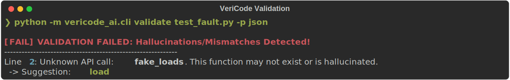
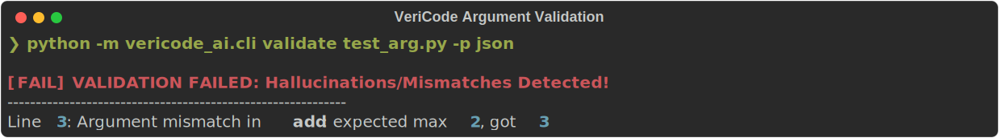
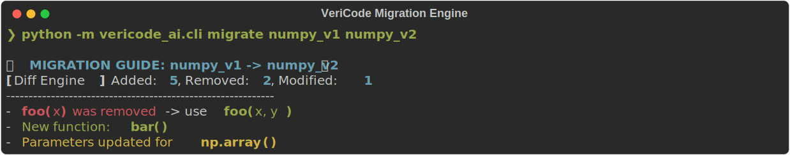
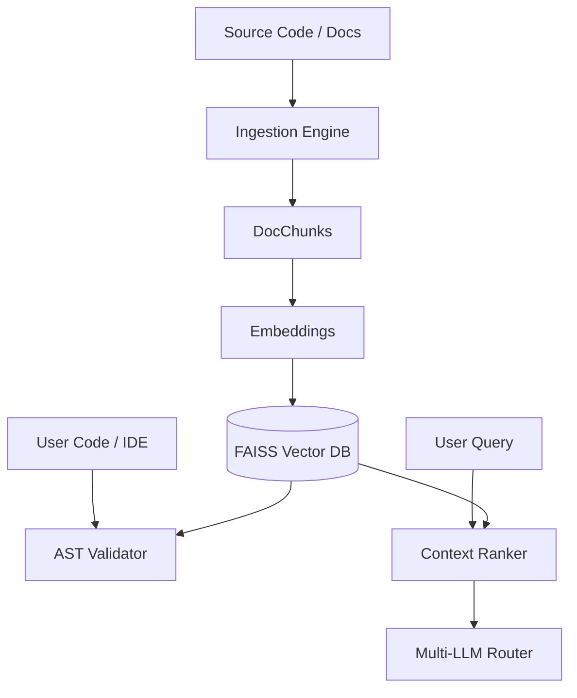

# VeriCode AI — Zero-Hallucination Coding Engine

> LLMs generate code.  
> VeriCode AI makes sure it's **actually correct**.


---

## 🚨 The Problem

Modern AI coding assistants (ChatGPT, Copilot, etc.) often:
- ❌ Hallucinate APIs that don’t exist  
- ❌ Use incorrect function signatures  
- ❌ Break silently during version upgrades  

This leads to:
> Bugs, crashes, and wasted debugging time.

---

## 💡 The Solution

**VeriCode AI** is a ground-truth AI verification engine that:

- 🔍 Retrieves real documentation (RAG)
- 🧠 Validates code using AST parsing
- ⚠️ Detects invalid API usage instantly
- 🔄 Tracks API changes across versions
- 🧩 Integrates directly into VS Code

---

## ⚡ Features

- ✅ RAG over real documentation (FAISS + embeddings)  
- ✅ AST-based validation (no hallucinated APIs)  
- ✅ Argument verification (signature-aware)  
- ✅ Auto-fix suggestions (Did you mean...?)  
- ✅ API Diff Analyzer (breaking change detection)  
- ✅ Migration Guide Generator (LLM-powered)  
- ✅ VS Code Extension (real-time validation)  

---

## 🎥 Demo

### 🔥 Hallucination Rejection
*Detects invalid APIs instantly:*
```python
json.fake_loads(data)
```
> ❌ Unknown API → 💡 Suggestion: json.load



### ⚠️ Argument Validation
```python
test_func(a, b, c)
```
> ❌ Argument mismatch detected



### 🔄 Migration Detection
*Automatically detects API changes:*
```
foo(x) → foo(x, y)
New function: bar()
```



---

## 🏗️ Architecture



---

## 🧪 CLI Usage

### 🔍 Query Documentation
```shell
python -m vericode_ai.cli query "How to use json.load?" -p json
```

### ✅ Validate Code
```shell
python -m vericode_ai.cli validate test_fault.py -p json
```

### 🔄 Generate Migration Guide
```shell
python -m vericode_ai.cli migrate numpy_v1 numpy_v2
```

---

## 🧠 Why VeriCode AI Matters

Transforms AI coding from **probabilistic** → **deterministic**

Instead of trusting LLM guesses, VeriCode AI ensures:
- ✔ Every API exists
- ✔ Every call is valid
- ✔ Every change is tracked

---

## 🚀 Tech Stack

- **Python** (Core Engine)
- **FAISS** (Vector Search)
- **Sentence Transformers** (Embeddings)
- **AST** (Static Analysis)
- **OpenAI / Gemini** (LLM Router)
- **VS Code Extension** (TypeScript)

---

## 🏆 What Makes This Different

Unlike typical AI assistants:

| Feature | Others | VeriCode AI |
|---------|--------|-------------|
| Uses real docs | ❌ | ✅ |
| Prevents hallucinations | ❌ | ✅ |
| Validates code statically | ❌ | ✅ |
| Tracks API changes | ❌ | ✅ |
| Works inside IDE | ⚠️ | ✅ |

---

## 📌 Future Work

- 💻 Local LLM support (Ollama)
- 🔒 Type-level validation
- 🌐 Multi-language support

⭐ **If you find this useful, star the repo!**

---
*Tags: #ai #llm #rag #developer-tools #vscode-extension #static-analysis #machine-learning*
